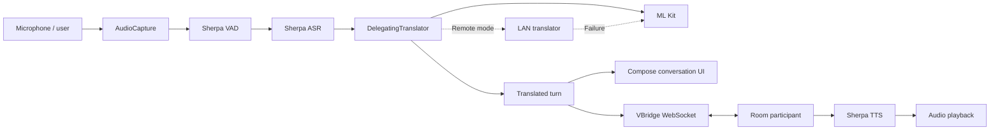
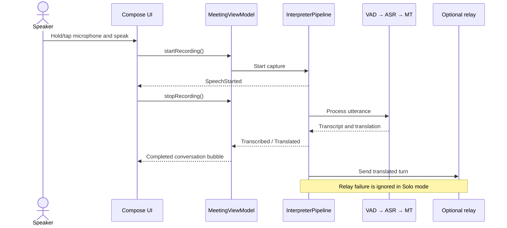

# VBridge

VBridge is an Android Vietnamese ↔ English speech interpreter built for fast, natural turn-taking. It combines on-device speech recognition, translation fallback, speech synthesis, optional peer relay, and a clear push-to-talk interface in one Jetpack Compose application.

> Speak Vietnamese or English, receive the translated text, and let the device speak it aloud for the other person.

## Why VBridge

Language tools often assume a stable internet connection or force every conversation through a remote service. VBridge separates local interpretation from optional networking:

- **Solo mode:** interpret a face-to-face conversation on one device without requiring the room relay.
- **Room mode:** relay translated turns between two participants over WebSocket.
- **On-device translation:** use ML Kit as the default translation engine.
- **Remote translation:** prefer a LAN server while automatically falling back to ML Kit if it fails.
- **Hands-on capture:** hold the microphone to speak and release to process one turn.
- **Hands-free capture:** tap to start and tap again to stop.

The local translation result remains successful even when the relay is disconnected. A network failure does not erase or incorrectly mark an already completed local turn as failed.

## Demo highlights for judges

1. Launch the app and grant microphone permission.
2. Enter a display name, room code, and speaking language.
3. Open Settings and select:
   - `Solo` or `Room`
   - `On-device` or `Remote`
   - `Hands-on` or `Hands-free`
4. Speak in Vietnamese or English.
5. Watch the turn move through transcription and translation states.
6. See local and remote speakers rendered on opposite sides of the conversation.
7. During remote playback, observe the disabled microphone and “It’s their turn…” floor indicator.
8. Stop the LAN translation server while Remote is selected—the next turn still completes through `MLKit (fallback)`.

For the strongest offline demonstration, use `Solo + Hands-on + On-device`. ML Kit language models may require a first-time download before an entirely disconnected demonstration.

## Features

| Area | Capability |
|---|---|
| Languages | Vietnamese ↔ English |
| Speech recognition | On-device Sherpa-ONNX ASR models for Vietnamese and English |
| Voice activity | Silero VAD through Sherpa-ONNX |
| Translation | ML Kit on-device baseline; optional LAN engine with automatic fallback |
| Speech synthesis | On-device Sherpa-ONNX/Piper voices for Vietnamese and English |
| Connectivity | Solo interpreter or WebSocket room relay |
| Capture | Hold-to-talk and tap-to-toggle modes |
| Conversation UI | Directional bubbles, turn progress, errors, retry affordance, animated states |
| Floor control | Prevents local capture while a remote turn is being spoken |
| Diagnostics | Pipeline telemetry and latency tracing |
| Reliability | Duplicate-event filtering, bounded channels, coroutine cancellation, offline-safe relay handling |

## Architecture





The pipeline uses bounded coroutine channels for ASR, machine translation, and TTS stages. Heavy work stays on `Dispatchers.Default` or `Dispatchers.IO`, outside the Compose main thread.

## Technology stack

- Kotlin 2.x
- Android SDK 35, minimum SDK 24
- Jetpack Compose and Material 3
- Kotlin Coroutines and StateFlow
- Sherpa-ONNX for VAD, ASR, and TTS
- Google ML Kit Translation
- OkHttp WebSocket and HTTP clients
- Android DataStore
- JUnit and kotlinx-coroutines-test

## Requirements

- Android Studio with Android SDK 35
- JDK 11 or newer; Android Studio’s bundled JDK is suitable
- Android 7.0/API 24 or newer
- An ARM target (`arm64-v8a` recommended; `armeabi-v7a` also packaged)
- A microphone-capable device or emulator
- Internet access for the initial Gradle dependency download

An x86-only emulator may not load the packaged Sherpa native libraries. A physical ARM Android device is recommended for judging and speech testing.

## Quick start with Android Studio

1. Clone this repository.
2. Open the repository root—the folder containing `settings.gradle.kts`—in Android Studio.
3. Wait for Gradle sync to complete.
4. Confirm the model directories exist under `app/src/main/assets/`.
5. Connect an ARM Android device with USB debugging enabled.
6. Run the `app` configuration.
7. Grant microphone permission.

## Build from the command line

Run these commands from the repository root.

### Windows

```powershell
.\gradlew.bat testDebugUnitTest
.\gradlew.bat assembleDebug
.\gradlew.bat installDebug
```

### macOS or Linux

```bash
./gradlew testDebugUnitTest
./gradlew assembleDebug
./gradlew installDebug
```

The debug APK is generated under:

```text
app/build/outputs/apk/debug/
```

## Model assets

The repository currently contains the models expected by the app:

```text
app/src/main/assets/
├── vad/silero_vad.onnx
├── asr-en/{encoder.onnx, decoder.onnx, joiner.onnx, tokens.txt}
├── asr-vi/{encoder.onnx, decoder.onnx, joiner.onnx, tokens.txt}
├── tts-en/{vits.onnx, tokens.txt, espeak-ng-data/}
└── tts-vi/{vits.onnx, tokens.txt, espeak-ng-data/}
```

If the assets are missing, Windows users can download and arrange them with:

```powershell
powershell -ExecutionPolicy Bypass -File .\app\fetch_models.ps1
```

Model downloads are large. Do not rename them unless the corresponding paths in `MeetingViewModel.initializePipeline()` are updated.

## Configure optional services

VBridge reads service URLs from Gradle properties:

```properties
VBRIDGE_RELAY_URL=wss://your-relay.example/ws
VBRIDGE_LAN_URL=https://your-translation-server.example:8000
```

Place machine-specific values in your user Gradle properties file when possible:

```text
~/.gradle/gradle.properties
```

### Room relay

`VBRIDGE_RELAY_URL` is used only in Room mode. Participants using the same room code exchange translated events through the relay.

### LAN translation API

Remote translation sends:

```http
POST {VBRIDGE_LAN_URL}/translation
Content-Type: application/json

{"text":"Hello","from":"en","to":"vi"}
```

Accepted response forms include:

```json
{"translation":"Xin chào"}
```

```json
{"text":"Xin chào"}
```

or a bare translated string. Empty, malformed, or unreachable responses activate the ML Kit fallback.

Prefer HTTPS. Modern Android versions block cleartext HTTP by default; a development HTTP server needs a narrowly scoped network-security configuration.

## Project structure

```text
VBridgeDemo/
├── app/
│   ├── doc/                 Detailed design and beginner documentation
│   ├── src/main/assets/     ONNX models, tokens, and eSpeak data
│   ├── src/main/java/       Kotlin source code
│   ├── src/main/res/        Android resources
│   ├── src/test/            JVM unit tests
│   ├── src/androidTest/     On-device tests
│   └── build.gradle.kts     Android module configuration
├── gradle/                  Wrapper and dependency version catalog
├── settings.gradle.kts      Modules and repositories
├── gradle.properties        Shared Gradle properties
└── gradlew / gradlew.bat    Reproducible build entry points
```

Important packages under `com.example.demovbridge`:

| Package | Purpose |
|---|---|
| `pipeline` | Interpreter orchestration, events, interfaces, modes, diagnostics, ViewModel |
| `audio` | Microphone capture and speaker playback |
| `vad` | Voice activity detection |
| `asr` | Vietnamese and English speech recognition |
| `translation` | ML Kit, LAN translation, runtime switching, fallback |
| `tts` | Vietnamese and English speech synthesis |
| `network` | Room relay WebSocket |
| `net` | LAN translation HTTP client |
| `ui` | Compose components, conversation bubbles, and theme |
| `data` | Participant configuration persistence |
| `benchmark` | Pipeline latency tracing |

## Testing

Run the complete JVM suite and build before submitting changes:

```powershell
.\gradlew.bat testDebugUnitTest assembleDebug
```

Automated coverage includes:

- Pipeline construction and lifecycle
- Offline relay failures not corrupting completed turns
- Runtime translator switching
- Remote translation fallback
- Translator resource ownership
- LAN response parsing and malformed responses

Recommended manual checks:

- Airplane mode: `Solo + Hands-on + On-device`
- Hands-free capture start/stop
- Room disconnect/reconnect
- Microphone disabled during remote playback
- Remote engine with the LAN server online
- Remote engine with the LAN server offline, confirming ML Kit fallback

## Design guarantees

- Local interpretation is independent from the optional peer relay.
- ML Kit remains the guaranteed translation fallback.
- Successful local translations are not changed to errors by expected Solo-mode send failures.
- Remote playback owns the conversational floor and temporarily blocks microphone capture.
- Pipeline events remain the contract shared by orchestration, UI, and latency tracing.
- Native and Android resources are released through pipeline lifecycle methods.

## Current limitations

- Only Vietnamese and English are configured.
- Room mode requires a compatible external WebSocket relay.
- Remote MT requires a compatible `/translation` server.
- ML Kit may download language models on first use.
- Native binaries currently target ARM ABIs, not x86.
- Barge-in during remote speech is intentionally not enabled.
- `PhoMtTranslator` is a placeholder for a future on-device engine.

## Documentation

- [Beginner guide, architecture, installation, and folder ownership](app/doc/BEGINNER_GUIDE.md)
- [Original feature implementation brief](app/doc/VBRIDGE_FEATURES.md)
- [Follow-up engineering tickets](app/doc/VBRIDGE_FEATURES_FOLLOWUP.md)

## Privacy and deployment notes

VAD, ASR, and TTS run from models packaged with the application. Translation stays on the device in On-device mode. Room relay and Remote translation deliberately send conversation data to configured services; deployers should document their server retention, security, and privacy policies.

Do not commit credentials, private service URLs, `local.properties`, build output, or IDE-specific files.

## Contributing

1. Create a focused branch.
2. Keep heavy work outside the main thread.
3. Preserve Solo/offline behavior and ML Kit fallback.
4. Add or update tests for pipeline changes.
5. Run tests and assemble the APK.
6. Review `git diff --check` before committing.

```powershell
git status --short
git diff --check
.\gradlew.bat testDebugUnitTest assembleDebug
```

VBridge is an active prototype intended to demonstrate reliable, understandable speech interpretation across both offline-first and connected conversation scenarios.
