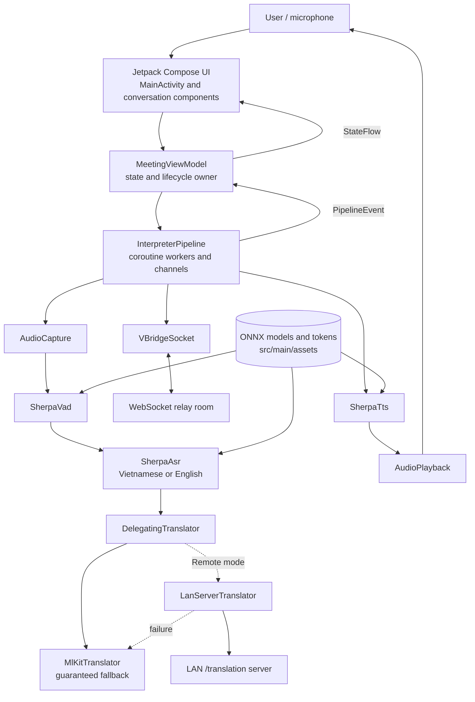
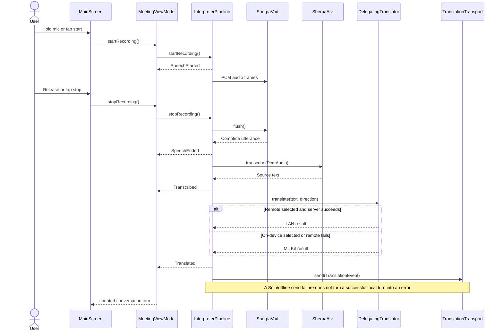
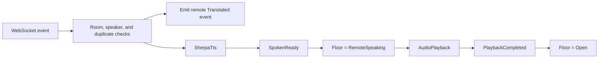

# VBridge Beginner Guide

This guide explains how VBridge is organized, how speech moves through the app, how to install and run it, and where a beginner should make changes.

## 1. What VBridge does

VBridge is an Android Vietnamese ↔ English speech interpreter. It records speech, detects an utterance, transcribes it, translates it, and speaks the result.

The app has three independent runtime choices:

- **Connectivity:** `Solo` keeps the conversation on one device; `Room` relays translated turns to another participant.
- **Translation:** `On-device` uses ML Kit; `Remote` tries a LAN translation server and automatically falls back to ML Kit.
- **Capture:** `Hands-on` records while the microphone is held; `Hands-free` starts and stops with taps.

ASR, VAD, and TTS use Sherpa-ONNX models stored in the APK. Solo mode with on-device translation is designed to work without a network after the required ML Kit model is available on the device.

## 2. Architecture



### Main ownership rule

`MeetingViewModel` creates and owns the pipeline dependencies. `InterpreterPipeline` processes turns. Compose reads `StateFlow` values from the ViewModel and sends user actions back to it.

Do not place ASR, translation, TTS, networking, or file work directly in a composable function.

## 3. Local speech pipeline workflow



Local translated turns are displayed on the device. Room transport sends them to peers. Incoming remote turns follow this playback workflow:



## 4. Requirements

- Android Studio with Android SDK 35 installed.
- JDK 11 or newer. Android Studio's bundled JDK is normally sufficient.
- An Android device or emulator running Android 7.0 / API 24 or newer.
- A microphone-capable target for speech testing.
- Internet access for the first Gradle dependency download.
- Optional: a WebSocket relay for Room mode.
- Optional: a compatible `/translation` HTTP service for Remote translation mode.

The APK includes native libraries for `arm64-v8a` and `armeabi-v7a`. Prefer an ARM Android device. An x86-only emulator may not run the native Sherpa libraries.

## 5. Install and run with Android Studio

1. Clone the repository.
2. Open the repository root—the directory containing `settings.gradle.kts`—in Android Studio.
3. Allow Gradle sync to finish.
4. Confirm that `app/src/main/assets` contains `vad`, `asr-vi`, `asr-en`, `tts-vi`, and `tts-en`.
5. Connect an Android device with USB debugging enabled, or start a compatible ARM emulator.
6. Select the `app` run configuration and press **Run**.
7. Grant microphone permission when requested.
8. Enter a display name and room code. For offline use, open Settings after startup and choose `Solo`, `On-device`, and the preferred capture mode.

Android Studio creates `local.properties` with the SDK path. Do not commit that file because SDK paths differ between computers.

## 6. Build and install from the command line

Run commands from the repository root.

### Windows PowerShell

```powershell
.\gradlew.bat testDebugUnitTest
.\gradlew.bat assembleDebug
```

Install the debug APK on a connected device:

```powershell
.\gradlew.bat installDebug
```

### macOS or Linux

```bash
./gradlew testDebugUnitTest
./gradlew assembleDebug
./gradlew installDebug
```

The assembled APK is written below `app/build/outputs/apk/debug/`.

Check connected devices with:

```text
adb devices
```

## 7. Runtime endpoint configuration

The build reads two Gradle properties:

```properties
VBRIDGE_RELAY_URL=wss://your-relay.example/ws
VBRIDGE_LAN_URL=https://your-lan-server.example:8000
```

For local development, put machine-specific values in the user Gradle properties file (`~/.gradle/gradle.properties`) when possible. Avoid committing private endpoints or credentials.

- `VBRIDGE_RELAY_URL` is used by `VBridgeSocket` in Room mode.
- `VBRIDGE_LAN_URL` is used by `LanFallbackClient` when Remote translation is selected.
- The LAN client sends `POST {VBRIDGE_LAN_URL}/translation` with `text`, `from`, and `to`.
- It accepts a bare response or JSON containing `translation` or `text`.
- Remote failures automatically use ML Kit and label the result `MLKit (fallback)`.

Modern Android versions block cleartext HTTP by default. Prefer HTTPS. If a development LAN server only supports `http://`, add a narrowly scoped Android network-security configuration instead of enabling cleartext globally.

## 8. Model assets

Expected layout:

```text
app/src/main/assets/
├── vad/silero_vad.onnx
├── asr-en/{encoder.onnx, decoder.onnx, joiner.onnx, tokens.txt}
├── asr-vi/{encoder.onnx, decoder.onnx, joiner.onnx, tokens.txt}
├── tts-en/{vits.onnx, tokens.txt, espeak-ng-data/}
└── tts-vi/{vits.onnx, tokens.txt, espeak-ng-data/}
```

These files are already present in this repository. If they are removed or missing, run the provided Windows downloader from the repository root:

```powershell
powershell -ExecutionPolicy Bypass -File .\app\fetch_models.ps1
```

The downloads are large. Do not rename model files without also updating the paths in `MeetingViewModel.initializePipeline()`.

## 9. Repository and folder map

```text
VBridgeDemo/
├── app/                         Android application module
│   ├── doc/                     Architecture, feature briefs, and this guide
│   ├── src/main/assets/         ONNX models, tokens, and eSpeak data
│   ├── src/main/java/.../       Kotlin application code
│   ├── src/main/res/            Android resources and launcher assets
│   ├── src/test/                JVM unit tests
│   ├── src/androidTest/         Tests that run on Android
│   ├── build.gradle.kts         App SDK, BuildConfig, ABIs, dependencies
│   └── fetch_models.ps1         Model download/setup helper
├── gradle/                      Version catalog and Gradle wrapper settings
├── build.gradle.kts             Root plugin configuration
├── settings.gradle.kts          Modules and dependency repositories
├── gradle.properties            Shared Gradle and endpoint properties
├── gradlew / gradlew.bat        Reproducible Gradle launchers
└── README.md                    Short project entry point
```

### Kotlin package instructions

All packages below live under `app/src/main/java/com/example/demovbridge/`.

| Folder | Responsibility | Beginner guidance |
|---|---|---|
| `asr/` | Speech-to-text with Sherpa-ONNX. | Change model configuration or transcription behavior here. Keep inference off the main thread. |
| `audio/` | Microphone capture, buffering, and speaker playback. | Check permissions and audio lifecycle carefully. Always release `AudioRecord`/playback resources. |
| `benchmark/` | End-to-end event timing. | Add measurements without changing existing `PipelineEvent` fields. |
| `data/` | Persisted participant settings using DataStore. | Add durable user preferences here, not inside composables. |
| `net/` | Low-level LAN translation HTTP client. | Keep request/response transport details here. Return failures so the translator can fall back safely. |
| `network/` | Room relay WebSocket and relay event models. | Room networking belongs here. Solo operation must continue when the relay is unavailable. |
| `pipeline/` | Core orchestration, interfaces, events, modes, ViewModel, and diagnostics. | Start here to understand the app. Preserve channel backpressure, cancellation, and offline behavior. |
| `translation/` | Translation interface, ML Kit, LAN wrapper, runtime delegation, glossary. | Every remote engine must fall back to `MlKitTranslator`; avoid double-closing translators. |
| `tts/` | Text-to-speech synthesis with Sherpa-ONNX. | Keep model paths aligned with assets and release native resources. |
| `ui/components/` | Reusable Compose controls such as top bar and mic FAB. | Components should receive state and callbacks rather than owning pipeline logic. |
| `ui/conversation/` | Conversation models, bubbles, turn status, and empty state. | Render `ConversationTurn` state here. Do not perform networking or inference here. |
| `ui/theme/` | Colors, typography, and Material theme. | Make global visual changes here before hard-coding colors in screens. |
| `utils/` | Small shared utilities such as asset copying and duplicate-event cache. | Keep utilities focused and independent of UI. |
| `vad/` | Voice activity detection interface and Sherpa implementation. | VAD decides when buffered audio is a complete utterance. Reset and flush correctly. |

### Important files

- `MainActivity.kt`: permission flow, setup screen, main Compose screen, settings sheet.
- `MeetingViewModel.kt`: constructs dependencies and exposes UI state/actions.
- `InterpreterPipeline.kt`: owns ASR, translation, network, and TTS worker loops.
- `PipelineInterfaces.kt`: testable boundaries for ASR, TTS, playback, and transport.
- `PipelineEvent.kt`: communication contract between pipeline, telemetry, and UI.
- `VBridgeConversation.kt`: conversation renderer and turn status UI.
- `DelegatingTranslator.kt`: live On-device/Remote switch and fallback guarantee.

## 10. State and concurrency rules

- Compose observes `StateFlow`; it does not mutate pipeline internals.
- `InterpreterPipeline.start()` creates a `SupervisorJob` on `Dispatchers.Default`.
- ASR and translation use channels so stages can run independently with bounded queues.
- Android/audio and network resources must be released in `stop()`, `close()`, `destroy()`, or `onCleared()`.
- Cancellation exceptions must be rethrown. Swallowing cancellation can leak work.
- A relay failure in Solo mode is expected and must not overwrite a completed local translation with an error.
- Remote translation is optional. ML Kit remains the guaranteed fallback.
- Remote playback owns the floor; local capture is disabled until playback completes.

## 11. How to add common features

### Add a pipeline event

1. Add a compatible event to `PipelineEvent.kt`; do not remove or rename existing fields.
2. Emit it from `InterpreterPipeline.kt`.
3. Handle it in `MeetingViewModel.handlePipelineEvent()`.
4. Render the resulting state in Compose.
5. Update `LatencyTracer` if timing is relevant.
6. Add a JVM test under `src/test`.

### Add another translation engine

1. Implement `Translator` in `translation/`.
2. Return a complete `TranslationResult` with a useful `modelName`.
3. Throw on unusable output so fallback can activate.
4. Wire it as the remote/primary leaf of `DelegatingTranslator`.
5. Keep ML Kit as the on-device fallback.
6. Test success, failure, switching, and `close()` ownership.

### Add a new screen or control

1. Put reusable controls in `ui/components/`.
2. Pass immutable state and callbacks into composables.
3. Store session state in `MeetingViewModel`; use `SettingsManager` for persistent state.
4. Add Compose previews for isolated visual components.

## 12. Testing

Run JVM tests after every pipeline or translation change:

```powershell
.\gradlew.bat testDebugUnitTest
```

Build the complete debug APK:

```powershell
.\gradlew.bat assembleDebug
```

Current focused tests cover:

- Normal pipeline construction and lifecycle.
- Offline transport failure not producing a network turn error.
- Runtime translator switching and ML Kit fallback.
- Translator close ownership.
- LAN response parsing and malformed responses.

Before release, manually test:

1. `Solo + Hands-on + On-device` in airplane mode.
2. Hands-free start and stop.
3. Room disconnect and reconnect.
4. Remote playback disabling the microphone until completion.
5. Remote translation with the LAN server running.
6. Remote translation with the LAN server stopped; the turn must still complete through ML Kit.

## 13. Troubleshooting

### Gradle sync fails

- Confirm Android SDK 35 and a compatible JDK are installed.
- Use the repository Gradle wrapper, not a separately installed Gradle version.
- Check access to Google Maven, Maven Central, JitPack, and the Sherpa repository listed in `settings.gradle.kts`.

### Native library or ABI error

Use an ARM device/emulator. The module packages `arm64-v8a` and `armeabi-v7a`, not x86 ABIs.

### Models cannot be opened

Compare `src/main/assets` with the expected layout above. Asset names are case-sensitive on Android.

### Microphone does nothing

- Grant Android microphone permission.
- In Hands-on mode, hold instead of tapping.
- Wait until remote playback finishes; the floor intentionally blocks local recording.

### Room shows Disconnected

- Solo mode does not need a relay and should display `Solo`.
- In Room mode, verify `VBRIDGE_RELAY_URL`, internet permission, server availability, and matching room codes.

### Remote translation always falls back

- Verify `VBRIDGE_LAN_URL` and `/translation` availability from the Android device, not only the development computer.
- An emulator reaches the host machine through a special host address (commonly `10.0.2.2` for the standard Android emulator), not `localhost`.
- Prefer HTTPS or add a narrowly scoped debug network-security policy for a cleartext development server.
- Check that the response is a bare string or JSON with `translation` or `text`.

## 14. Safe beginner workflow

```text
Create a branch → make one focused change → run unit tests → assemble debug → test on device → review git diff → commit
```

Useful commands:

```powershell
git status --short
git diff --check
.\gradlew.bat testDebugUnitTest assembleDebug
```

Avoid committing `local.properties`, build output, IDE-specific files, downloaded temporary archives, or credentials.
